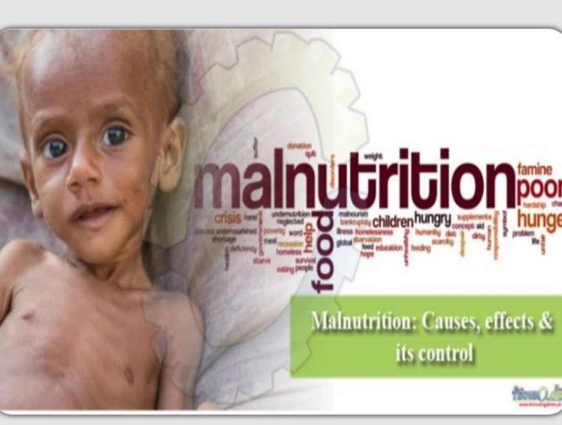
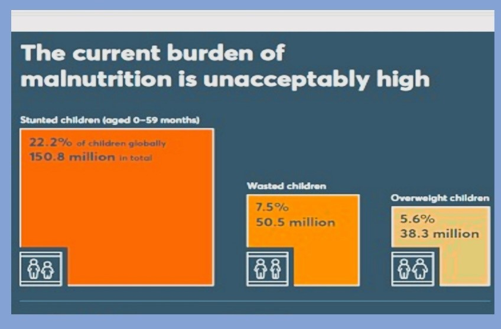
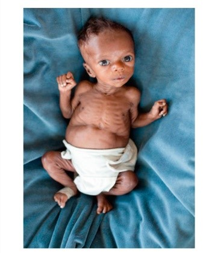
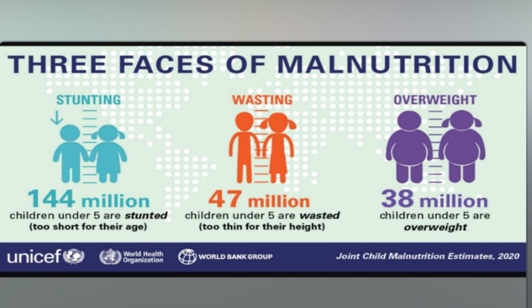
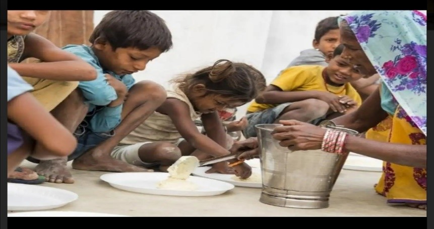

In humans, poor-diet or diet lacking basic nutrients leads to the condition termed as Malnutrition. Commonly, it is assumed that if less amount of healthy food is consumed it results in mal-nutrition but actually if we are taking excessive diet than our requirement it can also cause malnutrition. So, any sort of nutritional imbalance among adults, children, men, or women can cause a pathological state known as malnutrition.

**Malnutrition** means a person is not consuming proper Iron, Calcium, Proteins, Carbohydrates, Vitamins, and minerals. Thus the concept of a balanced diet is not clear to most people around the globe. Malnutrition is not specific to the developing world but developed countries are also at risk.

Scientifically, the requirement of basic nutrients depends on the age, gender, and region of human beings. Unfortunately, even in the 21st Century kids are more affected by malnutrition. A common cause of malnutrition is poverty. Poor people cannot afford the necessary food so their women during pregnancy take inadequate nutrients, which not only have adverse effects on their health but can severely affect the Brain and physiological growth of infants. Once they are born even then unhygienic and poor nutrition supply damages the health of the baby, which continues through their adolescence.

### Forms of Malnutrition

 

 

1. **Primary Malnutrition:** External dynamics such as Agricultural factors, Economical factors, and cultural factors contribute to this type of malnutrition.
2. **Secondary Malnutrition:** Internal dynamics such as, Diseases that do not allow the body to perform its normal metabolic activities.

### Types of Malnutrition

1. Under malnutrition: In-adequate nutrients or food taken for a long period of time. Also known as Starvation.
2. Over malnutrition: A condition in which a high level of food is consumed for a longer period.
3. Imbalance: It’s a pathological state in which the body faces a disproportion of nutrients.
4. Specific Deficiency: Deficiency of any specific nutrient can cause this state of malnutrition.

### Impact of Malnutrition Among Kids

Malnutrition can risk all age groups, particularly it has adverse effects when it comes to infants and children. According to UNICEF, half the ratio of deaths that occurred among kids age under 5 years is due to malnutrition. This is because of the lower immunity level and higher infection level. This lethal combination results in delayed recoveries and permanent damage to the body parts in some cases. Due to malnutrition, the ratio of low bodyweight of the child at birth is very high. Maternal and fetal health needs to improve in the future. The mortality rate of malnutrition among children is 54%, this means that 1 million children are not having even 1800 calories a day. WHO data clearly states that about 35% of children under the age of 5 years are underweight which increases the death ratio.

 

 

### Diseases caused in Children due to Malnutrition:

Nutrients named as “proximate principle” includes Proteins 10%, Fats 10-30%, and Carbohydrates 60-70% needs to be taken on average daily meal. Any of these if not taken in the required quantity would result in multiple infections such as Gastroenteritis, Measles, and pneumonia, etc. there are two types of undernourishment:

1. **Protein Energy Malnutrition (PEM):**
   It includes a pathological state raised by protein deficiency. A very common type of protein deficiency may cause **Kwashiorkor disease** in children age 1-3 years. In this disease, the body is unable to generate new muscles and leads to muscle wasting and hypoproteinemia.

    
   
    
   Another state named **Marasmus**, which causes total caloric malnutrition means body food intake is not sufficient enough to provide proteins.

    
   
    

   Both these conditions are observed among children of 6 months to 3 years of age.46-69 % of children are affected by PEM.

2. **Micro-Nutrient Deficiency:** According to WHO vitamins, iron, and iodine count for micro-nutrient deficiency. Anemia is one of the major illnesses caused by Iron deficiency among children. In this state hemoglobin cells are unable to bind iron to the blood cells. Kids of 6 month to 14 years are facing the macro or micronutrient deficiency. Vitamin A deficiency leads to blindness and in some cases death after severe diarrhea. Every one-third child is at risk of vitamin A deficiency, as per record from WHO. While iodine inadequate supply causes Iodine deficiency disorder, some major effects include mental retardation. During pregnancy, insufficient iodine results in cretinism, miscarriage, and in the case of birth, it affects the learning abilities of the child.

### Signs and Symptoms of Malnutrition

There are three stages recorded for children effected by malnutrition:

- **Stunting**: It is a state which affects a child in a fetus or early stages of birth. This means it has effects on the mother as well. Stunting results in reduced mental developmental abilities such as perception, memory, reasoning or judgment, etc., and the second direct effect is to the heights which remain limited.
- **Underweight**: This is a state of extremely low body weight than their age. In this case, body muscles are badly affected.- **Wasting**: This is an illness in which a child has low body weight than height. This state leads to rapid deterioration of health and is life-threatening.

 

 

All these three phases of malnutrition attribute to acute infections and reduced immunity among Children. Overall, there is a need to join hands to fight against malnutrition and its causes such as Poverty, sanitation, hygienic food.

### Prevention

Foremost step to eradicate malnutrition in children is to educate parents and adults about food groups, and nutrient distribution. Secondly, pregnant and lactating mothers should be given proper guidelines to supplement their bodies with basic nutrients. Also, there is a need to promote breast-feeding. Specific measures should be taken to immunize children, increasing the intake of fortified food, which could only be possible if foods are developed at low costs. Growth lagging should be diagnosed at earlier stages and periodic surveillance should be inducted.

 

 

### Key Take-Away

- Malnutrition is not limited to underweight conditions, but it also means overweight or improper diet consumption. Means it is relevant and total lack of necessary nutrients e.g. Vitamin A, Iron, and protein.
- Children’s across the globe are more affected by the underweight condition of malnutrition.
- Maternal health risks and nutrient deficient food has greater effects on underweight children.
- Health Education needs to be given through proper channels and early diagnosis with a treatment should be at ease for mothers and children.
- World Health Organization takes all measures to ensure basic needs of weaning a baby in developed and underdeveloped countries.
